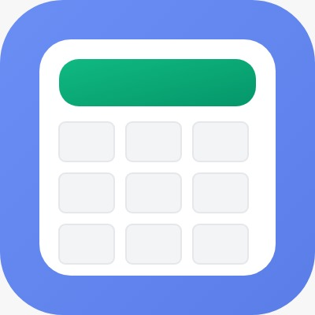
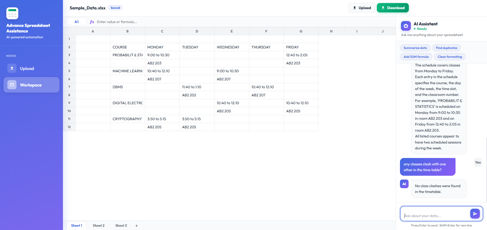

# 📊 Advance Spreadsheet Assistance
### *AI-Powered Data Analysis & Automation Platform*


**Advance Spreadsheet Assistance** is an intelligent web platform that democratizes data analysis. By combining a familiar spreadsheet interface with the power of **Google Gemini 2.5 Flash**, it allows users to clean, analyze, and visualize complex datasets using simple natural language commands.

---

## 🚀 Key Features

* **⚡ Instant Data Parsing:** Drag-and-drop support for CSV, Excel (`.xlsx`), and JSON files.
* **🤖 AI Data Analyst:** Integrated with **Google Gemini 2.5 Flash** to answer questions like:
    * *"Summarize the sales trend for Q3"*
    * *"Find all duplicate email addresses"*
    * *"Write an Excel formula to calculate profit margin"*
* **💬 Context-Aware Chat:** The AI understands your *specific* dataset (columns, rows, and values) to give accurate, context-aware answers.
* **🔒 Secure Local Processing:** Powered by a Python FastAPI backend that processes files locally for maximum speed and privacy.
* **⬇️ Smart Export:** One-click download of your analyzed and modified datasets.

---

## 📸 Project Screenshots

| **The Workspace** | **AI Analysis** |
|:---:|:---:|
|  |  |
| *Clean, distraction-free spreadsheet editor* | *Gemini analyzing data in real-time* |

---

## 🛠️ Tech Stack

### **Backend (The Brain)**
* **Language:** Python 3.10
* **Framework:** FastAPI (High-performance Async API)
* **AI Engine:** LangChain + Google Gemini 2.5 Flash
* **Data Processing:** Pandas, OpenPyXL

### **Frontend (The Face)**
* **Core:** HTML5, CSS3 (Glassmorphism Design), Vanilla JavaScript
* **Architecture:** RESTful API Consumption
* **Design:** Responsive "Glass UI" with CSS Variables

---

## ⚙️ Installation & Setup

Follow these steps to run the project locally.

### **1. Clone the Repository**
```bash
git clone [https://github.com/YOUR_USERNAME/Advance-Spreadsheet-Assistance.git](https://github.com/YOUR_USERNAME/Advance-Spreadsheet-Assistance.git)
cd Advance-Spreadsheet-Assistance
